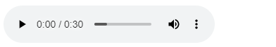

<!-- README.md is generated from README.Rmd. Please edit that file -->

```{r, include = FALSE}
knitr::opts_chunk$set(
  collapse = TRUE,
  comment = "#>",
  fig.path = "man/figures/README-",
  out.width = "100%"
)
```

# audioplayRmd

<!-- badges: start -->
[](https://CRAN.R-project.org/package=audioplayRmd)
<!-- badges: end -->

The goal of audioplayRmd is to provide the `include_audio()` function, the audio version of the `knitr::include_graphics`.

## Installation

``` r
install.packages("audioplayRmd")
```

## Example

```{r example}
# Illustrative only. github do not allow widgets =P
library(audioplayRmd)
include_audio("https://www2.cs.uic.edu/~i101/SoundFiles/PinkPanther30.wav")
```



<audio id="audio-player" controls="" src="https://www2.cs.uic.edu/~i101/SoundFiles/PinkPanther30.wav"></audio>

## Comments

- It should work for Rmarkdown, quarto and shiny.
- It is not vectorized.
- Google Chrome might block local files to be loaded (the "Not allowed to load local resource" error).
