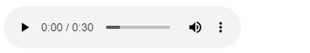

<!-- README.md is generated from README.Rmd. Please edit that file -->

# audioplayRmd

<!-- badges: start -->

[](https://CRAN.R-project.org/package=audioplayRmd)
<!-- badges: end -->

The goal of audioplayRmd is to provide the `include_audio()` function,
the audio version of the `knitr::include_graphics`.

## Installation

``` r
install.packages("audioplayRmd")
```

## Example

``` r
# Illustrative only. github do not allow widgets =P
library(audioplayRmd)
include_audio("https://www2.cs.uic.edu/~i101/SoundFiles/PinkPanther30.wav")
```

<div class="audioplayRmd html-widget html-fill-item-overflow-hidden html-fill-item" id="htmlwidget-05c25265037b070b8b9a" style="width:1px;height:54px;"></div>
<script type="application/json" data-for="htmlwidget-05c25265037b070b8b9a">{"x":{"audio_path":"https://www2.cs.uic.edu/~i101/SoundFiles/PinkPanther30.wav"},"evals":[],"jsHooks":[]}</script>



## Comments

- It should work for Rmarkdown, quarto and shiny.
- It is not vectorized.
- Google Chrome might block local files to be loaded (the “Not allowed
  to load local resource” error).
